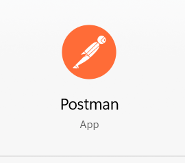
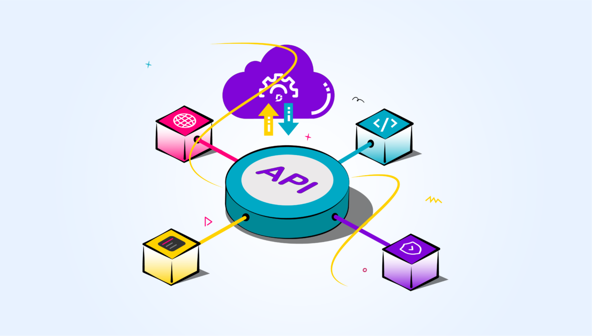

# 🛠️ My Internship Journey: Week 1

Welcome to the documentation of my first week as an intern! This week, I started with setting up essential tools and dived deep into understanding and using **GitHub Desktop**. Here's a day-by-day breakdown of my experiences and learnings.

---

## Day 1: Setting Up GitHub and GitHub Desktop

- **Created GitHub Account**: [Sign up here](https://github.com/).
- **Installed GitHub Desktop**: Set up GitHub Desktop on my workstation.
- **Connected GitHub Account**: Linked my GitHub account to the desktop application.
- **Cloned Repository**: Cloned my first repository to the local machine.

---

## Day 2: Exploring Repository Management

- **Branch Management**: Learned to create, switch, and delete branches.
- **Merge Conflicts**: Introduced to merge conflicts and how to resolve them using GitHub Desktop.
- **History and Changes**: Explored viewing commit history and changes.

### Highlights:
- **Branch Creation**: Created a feature branch for a small project.
- **Merge Practice**: Practiced merging branches and resolving conflicts.

---

## Day 3: Working with Pull Requests

- **Pull Requests**: Created my first pull request (PR) and understood the review process.
- **Reviewing Code**: Learned how to review code changes in a PR.
- **Merging PRs**: Merged PRs after reviews and resolved any issues.

### Highlights:
- **PR Workflow**: Understood the complete PR workflow from creation to merging.
- **Code Review**: Participated in a code review session with my mentor.

---

## Day 4: Advanced Features of GitHub Desktop

- **Stashing Changes**: Learned to stash and apply changes.
- **Reverting Commits**: Explored how to revert commits and reset branches.
- **Git Ignore**: Created a `.gitignore` file to exclude unnecessary files.

### Highlights:
- **Stash Management**: Successfully stashed changes and reapplied them later.
- **Safe Reverts**: Practiced safely reverting changes to keep the repository clean.

---

## Day 5: Finalizing the Basics and Setting Up Essential Tools

- **Linear Account**: Signed up for Linear using [this link](https://linear.app/).
- **Slack Channel**: Joined our team channel on Slack through [this invite link](https://join.slack.com/t/voldebug/shared_invite/zt-2iumetexw-POTY~yvapKdW6cvDGFCrTw).
- **Syncing Repositories**: Learned to sync local changes with the remote repository.
- **Working Offline**: Understood how to work offline and push changes later.
- **Tagging**: Created tags to mark specific points in the repository history.

### Highlights:
- **Collaboration Tools**: Set up essential tools for project management and communication.
- **Synchronization**: Kept the local and remote repositories in sync effectively.
- **Offline Work**: Managed to work offline and push changes when back online.
- **Tagging**: Used tags to organize the repository history for easy navigation.

---

## Reflections

This week was incredibly productive, and I learned a lot about using GitHub Desktop to manage repositories effectively, as well as setting up essential tools for project management and communication. The hands-on experience with various features and workflows has set a solid foundation for the rest of my internship.

Stay tuned for more updates as I continue my journey!

---

# 🛠️ My Internship Journey: Week 2

Welcome to the documentation of my second week as an intern! This week, I focused on learning about CRUD operations and implementing a CRUD application. Here's a day-by-day breakdown of my experiences and learnings.

---

## Day 1: Learning CRUD Operations

![Day 1]
- **Watched YouTube Tutorial**: Gained a solid understanding of CRUD operations (Create, Read, Update, Delete).
- **Resource**: [YouTube CRUD Tutorial](https://www.youtube.com/watch?v=_7UQPve99r4)

---

## Day 2: Setting Up the Project

- **Development Environment**: Set up the development environment and initialized the CRUD application project.
- **Dependencies**: Installed necessary dependencies.
- **Project Structure**: Created the initial project structure.

### Highlights:
- **Environment Setup**: Successfully set up the workspace.
- **Project Initialization**: Initialized the project with all necessary configurations.

---

## Day 3: Implementing Create and Read Operations

![Day 3]

- **Create Functionality**: Developed the functionality to add new data entries.
- **Read Functionality**: Implemented the functionality to view existing data entries.
- **Database Setup**: Created the data model and set up the database.
- **API Endpoints**: Developed API endpoints for Create and Read operations.

### Highlights:
- **Data Model**: Successfully created the data model.
- **Database Integration**: Integrated the database with the application.

---

## Day 4: Implementing Update and Delete Operations

- **Update Functionality**: Developed the functionality to modify existing data entries.
- **Delete Functionality**: Implemented the functionality to remove data entries.
- **Testing**: Tested the Update and Delete operations to ensure they work correctly.

### Highlights:
- **API Development**: Successfully developed and tested Update and Delete endpoints.
- **Bug Fixes**: Identified and fixed initial bugs in the implementation.

---

## Day 5: Testing and Finalizing the CRUD Application

- **Testing**: Wrote test cases for each CRUD operation.
- **Unit and Integration Testing**: Performed unit testing and integration testing.
- **Documentation**: Documented the application and its API endpoints.

### Highlights:
- **Comprehensive Testing**: Ensured the application works as expected through rigorous testing.
- **Documentation**: Created detailed documentation for future reference.

---

## Postman Testing

Below is an example of testing the CRUD API using Postman:

---

## Reflections

This week was incredibly productive, and I learned a lot about implementing and testing CRUD operations. The hands-on experience with API development and testing has been invaluable, setting a solid foundation for future backend development tasks.

Stay tuned for more updates as I continue my journey!

---

---

# 🛠️ My Internship Journey: Week 3

Welcome to the documentation of my third week as an intern! This week, I focused on understanding the VolDebug app and developing various APIs. Here's a day-by-day breakdown of my experiences and learnings.

---

## Day 1: Observing the VolDebug App

- **Downloaded VolDebug App**: Downloaded the zip file of the VolDebug app.
- **App Observation**: Thoroughly observed the app to understand where APIs can be utilized.

---

## Day 2: Creating Blog Standards API

- **Blog Standards API**: Developed Create, Read, and Update APIs for blog standards.
- **Blog Image API**: Created APIs for managing blog images.

### Highlights:
- **CRUD Operations**: Successfully implemented CRUD operations for blog standards.
- **Image Management**: Developed APIs to handle blog images effectively.

---

## Day 3: Deleting Blog Standards and Image API

- **Delete API for Blog Standards**: Created Delete API for blog standards.
- **Delete API for Blog Image**: Developed Delete API for blog images.
- **Schema Creation**: Designed the schema for blog titles.

### Highlights:
- **Deletion Handling**: Implemented deletion functionalities for blog standards and images.
- **Schema Design**: Created an efficient schema for managing blog titles.

---

## Day 4: Full CRUD for Blog Titles

- **Blog Title API**: Developed Create, Read, Update, and Delete APIs for blog titles.

### Highlights:
- **Complete CRUD**: Implemented full CRUD functionalities for managing blog titles.

---

## Day 5: Establishing Relationships

- **API Relationships**: Created the relationship between blog titles and images in the API.

### Highlights:
- **Data Relations**: Successfully established and managed relationships between different data entities.

---

## API Development

Below is an example image related to the API development process:

---

## Reflections

This week was highly productive, and I enhanced my skills in API development and data management. The experience of working with the VolDebug app and creating various APIs has been invaluable, providing a deeper understanding of backend development.

Stay tuned for more updates as I continue my journey!

---

---
# 🛠️ My Internship Journey: Week 4

Welcome to the documentation of my fourth week as an intern! This week, I focused on building APIs for managing blog information, specifically targeting the short description and long description models. Additionally, I established relationships between the blog title and these descriptions. Here's a day-by-day breakdown of my experiences and learnings.

---

## Day 1: Observing the VolDebug App

- **Downloaded VolDebug App**: Downloaded the zip file of the VolDebug app.
- **App Observation**: Thoroughly observed the app to understand where APIs can be utilized for managing blog information.

---

## Day 2: Developing Blog Information APIs

- **Short Description API**: Developed CRUD APIs for managing short descriptions of blog posts.
- **Long Description API**: Implemented APIs for handling detailed long descriptions of blog posts.

### Highlights:
- Successfully implemented CRUD operations for both short and long description APIs.
- Ensured data consistency and validation in API operations.

---

## Day 3: Establishing Relationships

- **Relationship Setup**: Established relationships between blog titles and their corresponding short and long descriptions.
- **Data Integration**: Ensured seamless integration and synchronization of data between different API endpoints.

### Highlights:
- Achieved cohesive data management by linking blog titles with descriptive content.
- Enhanced data retrieval efficiency through established relationships.

---

## Day 4: Schema Design and Optimization

- **Schema Refinement**: Optimized schema design for blog titles to accommodate relational data structures.
- **Performance Tuning**: Fine-tuned API endpoints for improved response times and scalability.

### Highlights:
- Designed an efficient database schema to support relational data handling.
- Implemented performance enhancements to meet application requirements.

---

## Day 5: Testing and Documentation

- **Unit Testing**: Conducted rigorous testing of APIs to ensure functionality and reliability.
- **Documentation**: Documented API endpoints, usage instructions, and data models for future reference.
- **Final Review**: Reviewed code and documentation with team members for feedback and improvement.

### Highlights:
- Thoroughly tested APIs to validate CRUD operations and data relationships.
- Created comprehensive documentation to facilitate ease of use and maintenance.
- Incorporated feedback for further refinement of code and documentation.

---

## Reflections

This week was a significant learning experience in API development and relational data management. I gained practical skills in building robust APIs, establishing data relationships, optimizing performance, and ensuring thorough testing and documentation. These skills are crucial for advancing in backend development and ensuring efficient data handling in applications.

Stay tuned for more updates as I continue my journey!

---

